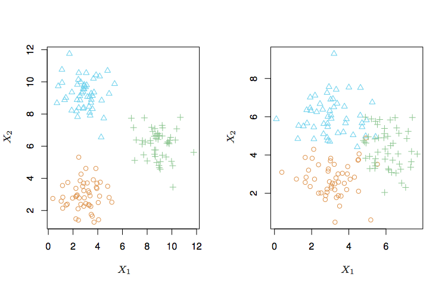

---
title: "社會科學統計方法"
author: "蔡佳泓"
date: "03/27/2018"
output:
  slidy_presentation:
    css: cssstyle.css
    footer: Chia-hung Tsai
  ioslides_presentation: default
subtitle: 研究設計(v1.0)
--- 

# 課程目標

- 資料如果沒有好的研究，無法產生價值。研究如果沒有好的基礎，也無法讓人信賴。
- 例如：我們常聽到「藍色星期一」，究竟有多少人（或者比例）在星期一感到憂鬱？這些人在其他天也會感到憂鬱嗎？
- 本週上課將介紹研究設計的基本概念以及原則，提供初學者一個設計研究的方向。   
- 例如我們仿照James等人(http://www-bcf.usc.edu/~gareth/ISL/ISLR%20First%20Printing.pdf) 在第二章的圖2.1，利用網路上的資料Advertising，觀察銷售量以及電視、廣播電台、報紙等三種廣告方式的關係，請問哪一種廣告與銷售量有關：

----

# 三種廣告與銷售量

(資料來源：http://www-bcf.usc.edu/~gareth/ISL/ISLR%20First%20Printing.pdf)
```{r echo=FALSE}
site="http://www-bcf.usc.edu/~gareth/ISL/Advertising.csv"
Advertising<-read.csv(file = url(site), sep=',', header = TRUE)
m1<-lm(sales ~ TV, data=Advertising)
m2<-lm(sales ~ radio , data=Advertising)
m3<-lm(sales ~ newspaper, data=Advertising)

```

```{r fig.width=12,fig.height=8,fig.align="center",out.width="1100px", echo=F}
par(mfrow=c(1,3))
with(Advertising, plot(TV, sales, ylab = 'Sales', xlab = 'TV', col='red'));abline(m1, col='blue', lwd=3)
with(Advertising, plot(radio, sales, ylab = 'Sales', xlab = 'Radio', col='red'));abline(m2, col='blue', lwd=3)
with(Advertising, plot(newspaper, sales, ylab = 'Sales', xlab = 'Newspaper', col='red'));abline(m3, col='blue', lwd=3)
```

----

# 基本架構

- 羅清俊（2007）建議研究的流程為：

   1.找到研究主題  
   2.根據理論形成概念與假設  
   3.測量概念  
   4.根據理論與概念收集資料  
   5.統計分析資料與詮釋  
   6.撰寫報告  
  
- 研究主題涉及到(1)研究對象也就是分析單位，(2)解釋的現象是相關或者是因果關係。
- 測量有信度與效度問題。
- 模型的目標有推論與預測。
- 統計分析有受監督(Supervised)與無監督(Unsupervised)統計。

----

# 分析單位

- 個人：所有成人、65 歲以上成人、孕婦等等
- 群體：學校的班級、醫院的單位
- 個人有可能受到群體的影響；個人的差異有可能同時來自群體以及個人本身
- 有分析單位才能確定測量的方式。例如：個人的身高、體重、生活品質必須以個人為單位進行測量。一個國家的醫療品質、生育率、離婚率等等則是以國家為單位測量。

----

# 相關

- 定義：兩個變數有一起變動的傾向。
- 例如：「挫折感」產生攻擊的傾向。
- 例如：做運動可以降低焦慮感。
- 相關的背後應該有理論。例如，科學家發現只要你的身體有在活動，看待周遭環境的看法就會改變，變得不再那麼有威脅、有攻擊性，也不會覺得有那麼多不安全感。

----

# 因果關係

- 如果兩個變數有相關，而且可以確定變數 X 是造成變數 Y 變動的唯一變數，X 與 Y 有因果關係。
- 例如：隨機分派兩組成年人。實驗組除了喝水之外，每天喝一杯紅酒，控制組每天只喝水。兩組的唯一差異來自於喝紅酒，因此紅酒跟心跳或是血壓之間可能有因果關係。
- 以方程式表示因果關係如下：  

<br>
$$ Y  =  \beta_{0}+\beta_{1}X_{1}+\beta_{2}D  $$

<br>
$$
D=\begin{cases}
1 & \text{喝紅酒}\\
0 & \text{其他}
\end{cases}
$$

----

# 因果關係

- 以方程式表示因果關係如下：  

<br>
$$ Y  =  \beta_{0}+\beta_{1}X_{1}+\beta_{2}D  $$

- 當$D=1$，上面的程式改寫為：  

$$ 
Y  =  \beta_{0}+\beta_{1}X_{1}+\beta_{2} 
  =  (\beta_{0}+\beta_{2})+\beta_{1}X_{1} 
$$  

- 當 $D=0$，  

$$
Y  =  \beta_{0}+\beta_{1}X_{1}+\beta_{2}\cdot 0 
  =  \beta_{0}+\beta_{1}X_{1} 
$$

- 相減等於 $\beta_{2}$，也就是類別變數 $D$ 的作用。

---- 

# 測量

- 抽象概念例如「生活品質」、「顧客滿意度」需要轉換成可測量的概念，測量之後得到變數。
- 例如：「顧客滿意度」就是對於品質以及付出價格相比在心理上的滿意程度。
- 一個概念如果有不止一個面向，可以考慮用一個以上的測量。
- 例如：「心理健康」測量包括自己的生理狀況評估、與家人、朋友相處情況等等。
- 例如：「休閒運動」測量包括去過幾次美術館、每週做幾次明顯的流汗運動等等。


----

# 測量的層次

- 名目：如果測量的目的是分類，屬於名目層次的測量
- 順序：如果測量的目的是排名次，屬於順序層次的測量，例如高、中、低。過去血壓超過140/90mmHg（毫米汞柱），才是高血壓，現在標準則降低為 120/80mmHg
- 等距：分數之間的距離相等，但是沒有絕對零點，例如智力沒有 0，所以不能說某人智力是另一人的倍數。
- 比值：除了等距之外還有絕對零點，例如講話的長度。


----

# 信度

- 測量的工具應該盡可能地測量到態度或是行為的真實分數，但是真實分數觀察不到，而是由測量分數與誤差所構成：  
<br>
X = T + E   
X：觀察分數   
T：真實分數   
E：誤差
  
<br>

- 當誤差為 0，測量工具完美地測量到真實的分數。但是施測時的環境或者是受訪者當時的狀況不一樣，
有可能產生測量的誤差。

  + 重測：對同一群人在不同時間進行同一測量，得到的相關分數稱為重測信度係數
  + 複本：從一組題目之中，選取部分題目進行測量，前後兩次的測量的相關係數，可得到複本信度。
  + 內部一致性：折半方法：把測量題目隨機分為一半或者增加一倍，然後計算各一半測驗分數的相關係數。

----

# 相關係數

- 變數X與Y的相關係數的公式為：

$$r= {\frac{\sum_{i=1\sim n} (X_{i}-\bar{X})(Y_{i}-\bar{Y})}{\sqrt{\sum (X_{i}-\bar{X})^2} \sqrt{ \sum (Y_{i}-\bar{Y})^2} }}$$

- $-1<r<1$

----

# 計算折半信度

- 以相關係數計算原始信度：
```{r echo=TRUE, warning=FALSE}
X<-c(2,2,2,1,3,5,3,5,4); Y<-c(2,1,3,1,2,1,4,4,5)
re <- cor(X, Y); re
```

- 假設增加一倍的數目，計算 Spearman-Brown 信度
```{r echo=TRUE, warning=FALSE}
library(CTT)
spearman.brown(re, 2)
```

----

# Cronbach's $\alpha$

- 1951 年 Cronbach 提出 $\alpha$ 係數，國內翻譯為柯能畢曲 $\alpha$ 係數。
$$
\alpha=\frac{k}{k-1}\cdot{1-\frac{\sum \sigma^2_{i}}{\sum \sigma^2}} 
$$
- k：題目數 
- $\sigma^2_{i}$：每一道題目的變異數
- $\sigma^2$：所有觀察值的分數的變異數
- 也可以轉換為相關係數
- Cronbach's $\alpha$
$$ \alpha=\frac{k\cdot{\bar{r}}}{1+(k-1)\cdot{\bar{r}}} $$
- $\bar{r}$：平均問項間相關係數

- $\alpha$ 為量表的總共變異量可歸因於同一來源或因素的比例。

----

# 實例

- 假設有問卷結果如下：
```{r include=FALSE}
df <- read.table('cronbachdata.txt', sep=';',header=T)
df <- data.frame(df)
head(df)
```

<table style="text-align:center"><tr><td colspan="11" style="border-bottom: 1px solid black"></td></tr><tr><td style="text-align:left"></td><td>V1</td><td>V2</td><td>V3</td><td>V4</td><td>V5</td><td>V6</td><td>V7</td><td>V8</td><td>V9</td><td>V10</td></tr>
<tr><td colspan="11" style="border-bottom: 1px solid black"></td></tr><tr><td style="text-align:left">1</td><td>0</td><td>0</td><td>0</td><td>0</td><td>0</td><td>0</td><td>1</td><td>1</td><td>0</td><td>0</td></tr>
<tr><td style="text-align:left">2</td><td>0</td><td>0</td><td>0</td><td>0</td><td>0</td><td>1</td><td>1</td><td>0</td><td>0</td><td>1</td></tr>
<tr><td style="text-align:left">3</td><td>0</td><td>0</td><td>0</td><td>0</td><td>1</td><td>1</td><td>1</td><td>1</td><td>0</td><td>1</td></tr>
<tr><td style="text-align:left">4</td><td>0</td><td>0</td><td>0</td><td>1</td><td>1</td><td>1</td><td>1</td><td>1</td><td>1</td><td>1</td></tr>
<tr><td style="text-align:left">5</td><td>0</td><td>0</td><td>1</td><td>1</td><td>1</td><td>1</td><td>1</td><td>1</td><td>1</td><td>1</td></tr>
<tr><td style="text-align:left">6</td><td>1</td><td>1</td><td>1</td><td>1</td><td>1</td><td>0</td><td>0</td><td>1</td><td>1</td><td>1</td></tr>
<tr><td style="text-align:left">7</td><td>0</td><td>1</td><td>0</td><td>1</td><td>0</td><td>1</td><td>0</td><td>1</td><td>0</td><td>1</td></tr>
<tr><td style="text-align:left">8</td><td>0</td><td>0</td><td>0</td><td>0</td><td>0</td><td>0</td><td>0</td><td>0</td><td>0</td><td>0</td></tr>
<tr><td style="text-align:left">9</td><td>1</td><td>1</td><td>1</td><td>1</td><td>0</td><td>0</td><td>0</td><td>0</td><td>0</td><td>0</td></tr>
<tr><td style="text-align:left">10</td><td>1</td><td>1</td><td>1</td><td>0</td><td>0</td><td>0</td><td>0</td><td>1</td><td>0</td><td>0</td></tr>
<tr><td style="text-align:left">11</td><td>0</td><td>0</td><td>1</td><td>1</td><td>0</td><td>0</td><td>1</td><td>0</td><td>0</td><td>1</td></tr>
<tr><td style="text-align:left">12</td><td>1</td><td>1</td><td>1</td><td>1</td><td>1</td><td>1</td><td>1</td><td>1</td><td>0</td><td>0</td></tr>
<tr><td style="text-align:left">13</td><td>1</td><td>1</td><td>1</td><td>0</td><td>0</td><td>1</td><td>0</td><td>0</td><td>0</td><td>0</td></tr>
<tr><td style="text-align:left">14</td><td>0</td><td>1</td><td>1</td><td>1</td><td>0</td><td>0</td><td>0</td><td>0</td><td>0</td><td>0</td></tr>
<tr><td style="text-align:left">15</td><td>0</td><td>0</td><td>0</td><td>0</td><td>1</td><td>0</td><td>1</td><td>0</td><td>1</td><td>1</td></tr>
<tr><td colspan="11" style="border-bottom: 1px solid black"></td></tr></table>

----

# Cronbach's $\alpha$

```{r echo=TRUE, warning=FALSE}
library(CTT)
reliability(df)
```

----

# 效度

- 正確地測量到心目中的概念
- 例如：智力定義為聰明的程度，因此，好的智力測驗應該能夠測量聰明的程度。智力測驗的分數越高，應該
表現出越高的推理能力。但是智力測驗可能無法測量到記憶力。
- 效度無法直接測量，只能間接地推論。
- 只有相對的效度，要由研究者來選擇哪一種測量比較適合。

----

# 信度與效度
```{r include=FALSE, warning=FALSE}
library(knitr)
opts_chunk$set(fig.width=8, fig.height=4.5, dpi=300, out.width="940px", out.height="529px")
```

{width=560px, height=500px}

----

# 效度的類型
- 表面效度：從測量的字面意義判斷是否具有效度
- 內容效度：但是進一步考慮概念的面向，判斷每一個題目是否符合測量的目標，
內容是否周延、具代表性、適切性、並確實包含所欲測量主題的內涵。

----

# 建構效度

- 用一個外在的測量與我們建立的測量進行相關分析，相關係數越高，代表測量具有效度。又可分為同時與預測效度  

- 同時效度：在同一個時間，進行兩種測量，其中一個已經公認具有效度，或稱為效標，另一個是不確定效度的測量。如果兩者出現理論上預期的相關，那麼可以確定測量的效度。心理健康與憂鬱症量表應該有高度相關，後者已經具有公認的效度，可以用來檢測前者的效度。  

- 預測效度：在測量進行之後一段時間，分析與效標之間的相關程度。如果相關程度高，代表測量具有效度。例如，國中三年級的成績，可以評估國中二年級的學習測量。
    
----    

# 構念效度

- 用更周延的理論架構，衡量測量能夠符合理論上的結構的程度。
- 根據理論，可以提出一些假設，而測量應該要符合理論的各種預期。
- 智力應該：
1. 隨著年齡而增長
2. 可以預測學業成就
3. 應該會受到不同教學方法的影響

- 因此智力測量的結果應該符合以上的預期，才具有構念效度。
- 如果沒有得到預期的發現，有可能是：
1. 沒有測量到所要測量的對象；
2. 理論架構有缺陷；
3. 研究設計沒有考慮其他潛在因素的影響。

----

# 變數與模型

- 根據理論收集資料，得到各種變數。例如：民主的程度、經濟成長的程度、軍事實力、貧富差距等等。  
- 有些潛在變數由多個可觀察的變數建構而成，例如民主程度可能包含定期選舉、公平競爭、司法獨立等等，稱為測量模型。圖形中的方形代表潛在變數，圓形代表可觀察變數，小的圓形代表誤差項：

```{r echo=FALSE, warning=FALSE}

library(DiagrammeR)

grViz("
digraph SEM {

graph [layout = neato,
       overlap = true,
       outputorder = edgesfirst]

node [shape = rectangle]

a [pos = '-4,1!', label = 'e1', shape = circle]
b [pos = '-3,1!', label = 'ind_1']
c [pos = '-3,0!', label = 'ind_2']
d [pos = '-3,-1!', label = 'ind_3']
e [pos = '-1,0!', label = 'latent a', shape = ellipse]
f [pos = '1,0!', label = 'latent b', shape = ellipse]
g [pos = '1,1!', label = 'e6', shape = circle]
h [pos = '3,1!', label = 'ind_4']
i [pos = '3,-1!', label = 'ind_5']
j [pos = '4,1!', label = 'e4', shape = circle]
k [pos = '4,-1!', label = 'e5', shape = circle]

a->b
e->b [label = '']
e->c [label = '']
e->d [label = '']

e->f [label = '', headport = 'w']
g->f [tailport = 's', headport = 'n']


f->h [label = '', tailport = 'ne', headport = 'w']
f->i [label = '']

j->h
k->i

}
")
```

----

# 統計學習

- 假設$Y$是依變數，$X=(X_{1},X_{2},\ldots,X_{p})$為自變數，兩者的關係寫成：$Y=f(X)+\epsilon$。$f$代表固定但是未知的函數，也就是$Y$與$X_{1},X_{2},\ldots,X_{p}$之間的關係。統計學習(statistical learning)包含許多估計$f$的方法。
- 統計學習的目的是：
 1. 預測：假設誤差項的平均值為0，$\hat{Y}=\hat{f}(X)$，也就是$f(X)$可以預測$Y$，因為$\hat{f}$只是$f$的預測，所以兩者之間有誤差。即使$\hat{f}$等於$f$，$\hat{Y}=f(X)+\epsilon$，$\epsilon$可能包含我們沒有測量到的變數，或是無法測量的變數，因此讓$\epsilon$或者是$E(\epsilon^2)=Var(\epsilon)$越小，預測就越準確。 
 2. 推論：如果我們關心的是$X$與$Y$之間的關係，例如可能有平方項，或者有負號。例如，某家公司收集了許多消費者資料，他們想要知道那些背景的消費者對於他們的產品有興趣，他們也可能只想知道正確地預測消費行為的程度，不論使用哪些變數。

----

# 觀察值與模型

- 左邊的圖顯示教育越高、收入也越高。右邊的圖顯示模型與觀察值之間的誤差。圖中的線代表可能的模型之一。
(來源：James et al (2013:17))
{width=560px, height=600px}


----

# 模型設定

- 訓練(training)：在統計學習中，觀察到的資料稱為訓練資料，例如我們有30筆資料，這就是我們的訓練資料，用來估計$f$。資料可寫成$\{(x_{1},y_{1}),(x_{2},y{2}),\ldots, (x_{n},y_{n})\}$，而每一個$x_{i}$，代表$x_{ij}$，$i$是觀察值，$j$則是$1,\ldots,p$的特徵或是變數。
- 如果訓練資料不同，$\hat{f}$應該會不同，而不同的$\hat{f}$之間的差異性稱為variance。越有彈性的方法將會產生越大的變異性。
- Bias指的是真實世界與模型之間的差距。如果$f$是非線性，那麼使用線性迴歸模型所得到的結果並不正確。
- Variance 與 Bias之間有衝突，估計方法越彈性，variance會提高，bias則會減少。因為越有彈性表示越接近資料，也就越接近真實世界。但是一旦改變資料，$\hat{f}$也隨之改變，也就是變異性增加。統計學習的目標為varinace與bias越小越好。

----

# 無母數與有母數方法

- $f$可以是有母數(parametric)或是無母數(non-parametric)，目標是讓$Y\approx \hat{f}(X)$。前者又稱為model-based，例如假設$Y$與$X$之間的關係為線性模型，也就是$Y\approx f(X)=\beta_{0}+\beta_{1}X_{1}+\ldots +\beta_{p}X_{p}$，$p+1$的$\beta$係數稱為參數，而我們需要估計這些參數的值。
- 無母數方法則不對$f$的型態做任何假設，目標是找到離資料點越近越好的$f$。
- 有母數的模型缺點是根據少數的參數估計的$f$有可能偏離資料，無母數的缺點則是需要許多資料點得到正確的$f$。而無母數方法可以得出比有母數方法更有彈性的模型。


----

# 詮釋與彈性

(來源：James et al (2013:25))
{width=600px, height=640px}

----

# 監督與不受監督

- 統計學習分成受監督與不受監督的方法。前者有$X$以及$Y$，後者只有$X$。如果是後者，我們可以考慮用集群分析(clustering)預測觀察值會落在哪一個分組。
- 如果有$p$個變數，會產生$p(p-1)/2$個散佈圖，我們便需要比較有效率的方式進行分組。

(來源：James et al (2013:27))
{width=560px, height=600px}
----

# 結論

- 研究設計需要好的研究問題，根據理論測量概念，並且使用模型加以分析。
- 模型來自於有母數與無母數方法，前者根據少數的參數估計$f$，後者根據許多資料點估計$f$，得到的模型更有彈性，但是比較難詮釋。
- 模型的目標有推論與預測。前者重視變數之間的關係，後者重視準確程度。
- 如果目標是推論，建議採用比較容易詮釋的方法，如果目標是預測，建議採用比較有彈性的方法。
- 統計學習分成受監督與不受監督的方法。前者有$X$以及$Y$，後者只有＄$X$。
- Variance 與 Bias之間有衝突，估計方法越彈性，variance會提高，bias則會減少。
