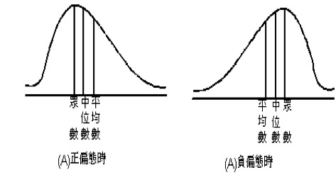
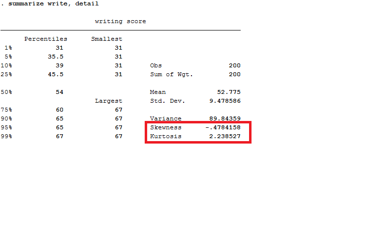
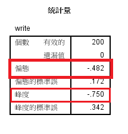

```{r setup, include=FALSE, echo=FALSE}
#library(knitr)
library(kableExtra)
knitr::opts_chunk$set(echo = TRUE, warning=FALSE)
options(knitr.table.format = "html")
```

# 課程目標
本週課程將介紹機率的基本概念，然後介紹描述統計，包括中央趨勢以及離散，也就是平均數、最小值、最大值、標準差等等，我們以`mtcars`為例：

```{r include=FALSE}
library(stargazer)
stargazer(mtcars, type='html')
```
<table style="text-align:center"><tr><td colspan="6" style="border-bottom: 1px solid black"></td></tr><tr><td style="text-align:left">Statistic</td><td>N</td><td>Mean</td><td>St. Dev.</td><td>Min</td><td>Max</td></tr>
<tr><td colspan="6" style="border-bottom: 1px solid black"></td></tr><tr><td style="text-align:left">mpg</td><td>32</td><td>20.091</td><td>6.027</td><td>10.400</td><td>33.900</td></tr>
<tr><td style="text-align:left">cyl</td><td>32</td><td>6.188</td><td>1.786</td><td>4</td><td>8</td></tr>
<tr><td style="text-align:left">disp</td><td>32</td><td>230.722</td><td>123.939</td><td>71.100</td><td>472.000</td></tr>
<tr><td style="text-align:left">hp</td><td>32</td><td>146.688</td><td>68.563</td><td>52</td><td>335</td></tr>
<tr><td style="text-align:left">drat</td><td>32</td><td>3.597</td><td>0.535</td><td>2.760</td><td>4.930</td></tr>
<tr><td style="text-align:left">wt</td><td>32</td><td>3.217</td><td>0.978</td><td>1.513</td><td>5.424</td></tr>
<tr><td style="text-align:left">qsec</td><td>32</td><td>17.849</td><td>1.787</td><td>14.500</td><td>22.900</td></tr>
<tr><td style="text-align:left">vs</td><td>32</td><td>0.438</td><td>0.504</td><td>0</td><td>1</td></tr>
<tr><td style="text-align:left">am</td><td>32</td><td>0.406</td><td>0.499</td><td>0</td><td>1</td></tr>
<tr><td style="text-align:left">gear</td><td>32</td><td>3.688</td><td>0.738</td><td>3</td><td>5</td></tr>
<tr><td style="text-align:left">carb</td><td>32</td><td>2.812</td><td>1.615</td><td>1</td><td>8</td></tr>
<tr><td colspan="6" style="border-bottom: 1px solid black"></td></tr></table>

---

# 機率
## 樣本空間
- 一個實驗中所有可能出現的結果 (outcomes) 所形成的集合稱為一樣本空間$S$。
- 例如德州奧斯汀的人很自豪地說世界上只有三種人: 第一是不知道有奧斯汀這個地方的人，第二是知道奧斯汀但恨不能來此定居的人，第三是已經住在這裡的人。假如這個說法為真，我們隨便問一個美國人，那麼他應該屬於$S=\{$不知道有奧斯汀, 知道奧斯汀但恨不能來此定居, 已經住在這裡的人$\}$其中之一。
- 由於每一種可能的結果皆屬於樣本空間，故亦可稱為元素或樣本點。  
- 事件 (event) 為結果所形成的集合，事件為 $S$ 的子集,以大寫字母 ($A, B, C, \ldots$) 表示，可分為以下兩種類型:
  - 1.事件中只有包含一個元素稱作簡單事件 (simple event, 亦稱為樣本點) 例如投擲一顆骰子得點數 3。
  - 2.事件中包含兩個以上的元素稱作複合事件 (compound event)，例如投擲兩顆骰子得點數和為 3 或 5 或 7。

- 若 A, B 兩事件滿足 $A\cap B=\emptyset$時, 則稱此A事件與B事件為互斥事件 (disjoint events)。

----

## 機率公設
- 對於任意事件 $E$ 皆滿足：$P(E) \geq 0$。（Non-negativity）
- 樣本空間 $S$ 的機率等於 1，寫作 $P(S) = 1$。（Normalization）
- 如果 $A_{1}$，$A_{2}$，$A_{3}$\ldots ，為一組有限或者可數的無限的事件且彼此為互斥事件，則這些事件所聯集的機率等於個別事件的機率和等於  
$P(A_{1} \cup A_{2} \cup A_{3} ∪ · · ·) = P(A_{1}) + P(A_{2}) + P(A_{3}) + \cdots$ （Additivity）

----

## 實例
- 丟一枚硬幣，樣本空間$S=\{$正面，反面$\}$，出現正面的事件$E=\{$正面$\}$
- 丟一個六面的骰子，樣本空間$S=\{1,2,3,4,5,6\}$，出現偶數的事件$E=\{2,4,6\}$
- 丟一枚硬幣兩次，樣本空間$S=\{HH, HT, TH, TT\}$，第一次丟擲出現正面的事件為$E=\{HH, HT\}$
- 丟一個骰子兩次，樣本空間$S=\{(i,j):i,j=1,2,\ldots,6\}$，共有36個元素。兩次骰子點數總和為10為事件之一。

----

## 聯合機率 (Joint probability)

- 定義：兩個事件同時發生的機率，或者是兩個事件交集的機率，可表示為 $p(A,B)$ 或者是 $p(A\cap B)$.
- 例如: 一張撲克牌，同時為紅色且為四點的機率為$p(four, red)=2/52=1/26$
- 民調顯示，有17\%的美國人同時養狗與養貓，可表示為$p(dog\cap cat)=0.17$

----

## 獨立事件 (Independent Events)

- 如果事件 $A$ 發生時與事件 $B$ 沒有關係，或者是當 $P(A,B)=P(A)\cdot P(B)$, 也就是 $P(A|B)\cdot P(B)=P(B)$，這兩個事件稱為獨立事件。
- 擲一顆骰子兩次，第一次得到6的機率與第二次得到6的機率相互獨立。
- 抽一張撲克牌，放回去之後再抽一次，第一次抽到紅心的機率與第二次抽到紅心的機率相互獨立。
- 規則：$P(A\cap B)=P(A,B)=P(A)\cdot P(B)$ 

----

## 互斥事件 (Disjoint Events)
- 兩個事件不可能同時發生，稱為互斥事件。兩個互斥事件的機率 $P(A\cup B)=P(A)+P(B)$
- 例如，一個學生不可能同時為大一學生，也是大四學生，所以是互斥事件。但是一個學生可以同時為大一學生
也是男生。
- 例如: $C=\{1,3,5\}, D=\{2,4,6\}$. $C$ 與 $D$ 事件為互斥。 $C\cap B=\emptyset$. $P(C,D)=0$

----

## 實例
- 從52張撲克牌抽到紅色的牌與抽到有臉的牌是否為獨立事件?  

- 抽到紅色牌的機率$P(Red)=\frac{1}{2}$ 
- 抽到有臉的牌的機率$P(Face)=\frac{12}{52}=\frac{3}{13}$ 
- 抽到紅色且有臉的牌的機率$P(R,F)=\frac{6}{52}=\frac{3}{26}$
- $\frac{1}{2}\cdot\frac{3}{13}=\frac{3}{26}$
- 因為$P(R,F)=P(Red)\times P(Face)$，所以抽到紅色的牌與抽到有臉的牌是獨立事件

----

## 邊際機率（Marginal Probability）
- 定義：在兩個或兩個以上的樣本空間中，只考慮某一個條件成立所發生的機率。
- 例子： 有一個樣本空間 $S=\{1,2,3,4, 5,6,7,8,9,10\}$.   
$P(A)=P(x={\rm black}\}=0.4$.   
$P(B)=P\{x\geq 6\}=0.5$  

-  使用councilor這筆資料，交叉分析年度與發包單位，計算邊際機率：
```{r}
councilor<-read.csv('councilor.csv', sep=',',header=TRUE, fileEncoding = 'BIG5')

tu<-table(councilor$Year, councilor$unit)
tu
margin.table(tu,1)/sum(tu)
```
  
計算得知，2015年與2016年的邊際機率分別為0.2及0.8。

----

## 條件機率（Conditional Probability）

- The probability of event A when B is true (or occurs). It is denoted as $P(A|B)$. The probability of $A$ occurring is conditional on $B$ having occurred.
- Manipulation: $P(A|B)=\frac{P(A\cap B)}{P(B)}$. The joint probability of A and B divided by the marginal probability of B.
- $P(A\cap B)=P(A|B)\cdot P(B)=P(B\cap A)=P(B|A)\cdot P(A)$

----

## 互賴事件 (Dependent Events)

- 互賴事件指的是A事件的機率會影響B事件的機率。可以定義為兩個事件的聯合機率不等於相乘。或者是條件機率不等於邊際機率。
- 例如:從52張撲克牌中以抽出不放回的方式抽出兩張牌，第2張牌是皇后的機率為何?
- 假設$P(E)$代表第2張牌是皇后的機率，$P(A)$是第一張牌為皇后的機率，$P(A')$是第一張牌不是皇后的機率
- $P(A)=\frac{4}{52}$, $P(A')=\frac{48}{52}$, $P(E|A)=\frac{3}{51}$, $P(E|A')=\frac{4}{51}$
$$
P(E) =P(E\cap A)+P(E\cap A')
 = P(A)\cdot P(E|A)+P(B)\cdot P(E|B) $$
$$ 
 = \frac{4}{52}\cdot\frac{3}{51}+\frac{48}{52}\cdot\frac{4}{51} 
 = \frac{1}{13} $$


---

# 描述統計

- 以最有效率的方式描述人口或是特定群體的量化或類別變數的重要特徵
- 分析單位可以是個體或是群體。
- 群體的描述統計，例如：都市化、經濟成長率、競爭力、購買力$\ldots$
- 個體的描述統計，例如：個人的性別、教育程度、滿意度、收入、政治態度$\ldots$
- 可分為中央趨勢以及離散程度兩個面向
- 可以以文字或者是圖形表示
  
例如我們想知道26名學生的性別以及學系分佈？

```{r echo=TRUE}
students<-read.table('studentsfull.txt', sep='', header=TRUE)
df <- data.frame(students)
library(knitr)
table(df$Gender)
kable(table(df$Gender))
kable(100*table(df$Department)/nrow(df))
```


---

# 中央趨勢

用一個統計值描述資料的分佈：  

- 眾數
- 中位數
- 百分位數
- 平均數

----

## 眾數
- 適用於質化變數，不適用於連續變數。
- 定義為發生最多次的那一個類別，有可能超過一個。
- 相對於其他類別，眾數所在的類別可以代表較可能發生的事件。如果知道眾數所在的類別，可以用這個類別去猜測或是代表資料以外的事件。
- 例如已知多數的警察是男性，我們如果隨機抽出一位警察，應該會猜該受訪者是男性。但是我們仍然有 $100\times (1-m)\%$ 的機會犯錯，$m$ 代表已知警察為男性的比例，$1>m>0$。如果有其他資訊，我們可以降低 $100\times (1-m)\%$。
- 例如已知某一個國家的警察之中有6成貪污，$m=0.6$，我們有$100\times (1-0.6)\%=40\%$誤認警察收賄的可能。

----

## 中位數(Median, Md)
- 在一個數列中，50$\%$的數比中位數大，50$\%$的數比它小。
- 中位數可用來表示收入、房屋年齡、房屋坪數、房價，例如2016年我國工業及服務業每人每月業薪資中位數為4萬853元
- 財政部財政資訊中心提供收入的中位數與平均數資料。營建署提供房價資料。
- 例如：內政部營建署調查公布的房價負擔能力指標，包含「房價所得比」與「貸款負擔率」兩項，「房價所得比」計算公式為「中位數住宅總價÷家戶年可支配所得中位數」，代表需花多少年的可支配所得才買到一戶中位數住宅總價，數值越高表示房價負擔能力越低。
- 例如在`UsingR`的套件中，`Boston`這筆資料有房價中位數的資料。
```{r include=FALSE}
library(UsingR)
head(Boston)
```

----

## 百分位數及中位數

- 把資料由小排到大，一半的數比中位數大，另外一半比中位數小。
- 可以是實際存在的數，也可以是計算所得。
- 有數種計算方式，根據資料的分佈而定。
- 最簡單的是遇到偶數的（已排列）資料數列，中位數是$\frac{a+b}{2}$，$a$、$b$是 $50\%$ 資料點相鄰的兩個數。如果是奇數的數列，就是找出分割一半的數。
- 例如：1到10，中位數是5.5。0到10，中位數是5

```{r}
A<-c(1:10); B<-c(0:10)
median(A); median(B)
```

----

## 百分位數
- 把資料由小排到大，第$p$個分位數表示(100-$p$)\%的數比它大，$p$\%的數比它小。可以表示資料的集中與分散。也被稱為百分等級(percentile rank)。例如pr99是286分。
- 可以是實際存在的數，也可以是計算所得。
- 有數種計算方式，根據資料的分佈而定。
- 第一種百分位數的計算公式：
$$p_{i}=100\cdot \frac{i}{n}$$
  
$$i=\frac{np_{i}}{100}$$

- 例如資料為：$X=(1, 1001, 1002, 1003)$
- 25 百分位所在位置$=\frac{4\times 25}{100}=1$。因此 25百分位為 1。
- 50 百分位所在位置為：$\frac{4\times 50}{100}=2$。因此 50百分位為 1001。
- 75 百分位所在位置為：$\frac{4\times 75}{100}=3$。因此 75百分位為 1002。

```{r}
X <- c(1, 1001, 1002, 1003)
quantile(X, c(.25, .5, .75), type=1)

```

----

## 比較SPSS與R的輸出

- 例如有一筆34位學生的成績資料，我們計算25, 50, 75, 90百分位的數字：

```{r}
scores<-c(15, 22, 26, 32, 33,36, 36, 41, 42, 44,
44, 45, 47, 48, 61,63, 63, 65, 65, 65,
66, 66, 68, 69, 70,71, 74, 74, 76, 77,
78, 78, 79, 85)
quantile(scores, c(.25,.5,.75,.9), type=6)
```

{width=500px, height=320px}

----

## 平均數
- 用在量化變數或是二元變數。
- 可以想成是觀察值的平衡點：比平均值大的數的總和等於比平均值小的數的總和的絕對值。
- 會受到極端值的影響。
- 可以考慮去掉頭尾的極端值再求平均數。
- 可分為簡單平均數跟分組平均數。

----

## 簡單平均數：
- $$\bar{y}=\frac{\sum y}{n}$$
- $$y={6, 7, 8, 8, 9, 10, 13, 15, 16, 45}$$
- $$\bar{y}=\frac{\sum (6+7+\cdots , +45)}{10}=13.7$$

----

## 分組平均數
- 假設觀察值分為$k=1\cdots k$個組，每一組有$y_{1}$,$y_{2}$,$\ldots$ 人，每一組平均數為$$\bar{y_{1}}, \bar{y_{2}},\cdots$$, 則全體的平均數為：  
 $$\bar{y}=\frac{\sum y_{k}\cdot \bar{y_{k}}}{n}$$
- 例如有三個空氣品質的觀測站的資料，要計算總平均數，首先從總和除以全部個案數計算：

```{r} 
A<-list(station1=c(25, 33, 44), station2=c(43, 66, 78, 81), station3=c(90, 76, 105, 110, 121))
A
groupn=sapply(A, length); groupn
Totaln=sum(sapply(A, length)); Totaln
Total=sum(sapply(A, sum)); Total
Total/Totaln
```
  
`sapply()`函數可套用函數在列表的每一個向量。  
以分組平均數計算總平均數：
```{r}
mn=sapply(A, mean); mn
mn*groupn
sum(mn*groupn)/Totaln
```

----

## 偏態(skewness)
- 測量資料是否分佈對稱
- 正偏：右邊的尾巴較左邊長，眾數偏左
- 負偏：左邊的尾巴較右邊長，眾數偏右
- 常態分佈的偏態值＝0
- 樣本偏態值$=\frac{n}{(n-1)(n-2)} \frac{\sum (x_{i}-\bar{x})^3}{s^3}$
- $s$是標準差$s=\sqrt{\frac{\sum (x-\bar{x})^2}{n}}$
- 有偏態時須注意平均值是否會誤導。

----

## 偏態型態

{width=600px, height=560px}

----

## R與Stata比較

- 偏態有多種計算方式，`R`的計算公式1與2分別與Stata以及SPSS得到的結果相同。
- 以學生的寫作成績為例:

```{r}
library(foreign)
hsb2<-read.dta('hsb2.dta')
library(e1071)
skewness(hsb2$write, type=1)
```
{width=600px, height=560px}

----

## R與SPSS比較

```{r}
skewness(hsb2$write, type=2)
```
{width=600px, height=560px}

----

## 峰度 (kurtosis)
- 測量資料的分佈是高聳或是平坦
- 越平坦則兩邊尾部越長，越高聳則是靠近平均值的部份越集中
- 計算峰度的公式：
$$\frac{m^4}{m^2_{2}}-3$$
$$s2=\sum (x_{i}-\bar{x})^2$$
$$s4=\sum (x_{i}-\bar{x})^4$$
$$m2=\frac{s2}{n}$$
$$m4=\frac{s4}{n}$$
- 不同統計軟體計算峰度的公式略有不同，如果用`R`，可以用`e1071`這個包裹裡面的`kurtosis`，用`type`指令選擇2可得到跟SPSS一樣的答案。
- Stata的計算峰度公式為$$\frac{m^4}{m^2_{2}}$$
- 樣本數目越大，理論上各種計算方式的結果越接近。

----

## 使用語法計算峰度
```{r}
s4=sum((hsb2$write-mean(hsb2$write))^4)
s4
m4=s4/200
s2=sum((hsb2$write-mean(hsb2$write))^2)
m2=s2/200
(m4/m2^2)
```
{width=600px, height=560px}

----

## 比較R與SPSS

```{r}
kurtosis(hsb2$write, type=2)
```

{width=600px, height=560px}
----

# 離散
## 範圍

- 範圍(range)：最大值及最小值的差距。
- 若是常態分佈，範圍約等於六個標準差。

```{r}
range(hsb2$write)
range(hsb2$math)
```

- 平均數相同，範圍可能不同

----

## 樣本變異數：母體變異數的無偏估計

- 標準差為變異數的平方根，代表觀察值與平均數之間的差距
- 變異數：$$\frac{\sum (X-\bar{X})^2}{n}$$
- 標準差：$$\sqrt{\frac{\sum (X-\bar{X})^2}{n}}$$

- 如果樣本來自二元分佈，即0,1，則樣本標準差為：

$$\sqrt{\frac{np(1-p)}{n-1}}$$
$p$ 是事件發生的機率。

----

## 樣本標準差
- 大於或等於0
- 因為是樣本標準差，故用n-1當分母
```{r}
var(hsb2$write)
std = function(x) sqrt(var(x))
std(hsb2$write)
sd<-function(V)sqrt( sum((V - mean(V))^2 /(length(V)-1)))
sd(hsb2$write)
```

- 如果樣本成常態分配，利用微積分可求出平均數的加減1個標準差包含約$68\%$的樣本。2個標準差包含約$95\%$的樣本。3個標準差包含約$$99\%$$的樣本。

----

# 近似常態分佈圖形
```{r}
set.seed(02138)
g<-rnorm(1000, 0, 1)
library(ggplot2)
gnorm<-data.frame(g)
testplot<-ggplot(aes(x=g, y=..density..), data=gnorm) +
   geom_histogram(bins=20,  fill='lightblue') +
   geom_density(aes(y=..density..), col='darkgreen') +
   theme_bw()
testplot 
```

----

## Z值或分數
- 考慮母體資料中的標準差與平均值，標準化觀察值以比較觀察值與平均值之間的距離
$$Z=\frac{x_{i}-\bar{x}}{\sigma}$$
或是
$$Z=\frac{X-\mu}{\sigma}$$
$$\sigma\neq 0$$
- 標準化常態分佈的$Z$值介於-3.4到3.4之間。
- $Z$值可轉換為百分位，百分位也可轉換為$Z$值。標準化常態分佈的$Z$=-1.96時，由左到右端點面積為$2.5\%$。
- 有一位員工的今年月薪為8.5萬，去年則為8萬，而去年的全體薪水標準差為2萬，平均值為6.5萬，今年的全體薪水標準差為2.9萬，平均值為6萬，請問該員工月薪相較於全體員工有增加嗎？
$$z_{1}=\frac{8.5-6}{2.9}=0.86$$
$$z_{2}=\frac{8-6.5}{2}=0.75$$
- 因為$z_{1}\geq z_{2}$，因此該員工月薪相較於全體員工有增加。

----

## 標準差的特性
- 改變樣本的單位，標準差也會改變
```{r}
H<-c(15000,7000,19000,3000,15000,19000,4000,12000,
       17000,  9000)
h<-c(15,7,19,3,15,19, 4,12,17, 9)
sd(H); sd(h)
```
  

- 加減樣本的值會改變平均值，但是不會改變標準差，因為$$\sum_{i=1\sim n} (x_{i}-\bar{x})$$變成$$\sum ((x_{i}+k)-\overline{x+k})=\sum x_{i}+k-\frac{\sum x}{n}-\frac{nk}{n}=\sum (x_{i}-\bar{x})$$

---

# 作業
- 1. 請計算studentsfull.txt這筆資料中的`score`中位數、90百分位數以及男性跟女性的平均數：
```{r include=FALSE}
df<-read.table('studentsfull.txt',sep='',header=TRUE)
median(df$Score)
quantile(df$Score, c(.9), type=1)

```

- 2. 請計算studentsfull.txt這筆資料中男性跟女性的`score`平均數以及標準差：
```{r include=FALSE}
mean(df$Score[df$Gender=='M'])
mean(df$Score[df$Gender=='F'])
sd(df$Score[df$Gender=='M'])
sd(df$Score[df$Gender=='F'])
```

- 3. 請使用`UsingR`套件中的`faithful`資料，請問要看噴泉最少要等幾分鐘？平均要等幾分鐘？最多跟最少等的時間差距多少分鐘？
```{r include=FALSE}
library(UsingR)
min(faithful$waiting)
mean(faithful$waiting)
range(faithful$waiting)
```

- 4. 請用`airquality`這筆資料的`Wind`這個變數，練習找出前後兩個資料點的差異。例如：
```{r}
A <- c(35, 61, 69)
d.A <- c(26, 8)
```

```{r include=FALSE}
diff(airquality$Wind)
#Alternative way
x <- c()
for (i in 1:nrow(airquality)){
   x<-airquality$Wind[i+1]-airquality$Wind[i]
print(x)
}
```

- 5. 請問`airquality`這筆資料的`Wind`的偏態為何？峰度是多少？
```{r include=FALSE}
library(e1071)
skewness(airquality$Wind, type=1)
kurtosis(airquality$Wind, type=1)
```

- 6. 請問在studentsfull.txt這筆資料中，性別的樣本標準差是多少？
```{r include=FALSE}
students<-read.table('studentsfull.txt', sep='', header=TRUE)
n=nrow(students); n
p=length(which(students$Gender=='M'))/n; p
sqrt(n*p*(1-p)/(n-1))
```

- 7. 在`councilor`這筆資料中，請問平均工程預算是多少？樣本標準差多少？
```{r include=FALSE}
setwd('~/Library/Mobile Documents/com~apple~CloudDocs/eastasia')
counc<-read.csv('councilor.csv', sep=',',header=TRUE, fileEncoding = 'BIG5')
mean(counc$budget)
sd<-function(V)sqrt( sum((V - mean(V))^2 /(length(V)-1)))
sd(counc$budget)
```

- 8. 使用`2008Election`這筆資料，請問馬英九的得票數的25分位數、中位數、75分位數分別是多少？請問25與75分位數之間差別多少？
```{r include=FALSE}
election<-read.csv('2008Election.csv', sep=',',header=TRUE)
KMT<-election$votes.of.Ma.Ying.jeou..KMT.
quantile(KMT, c(.25, .5, .75), type=6)
IQR(KMT)
#Alternatively
quantile(KMT, c(.25, .5, .75), type=6)[3]-quantile(KMT, c(.25, .5, .75), type=6)[1]
```